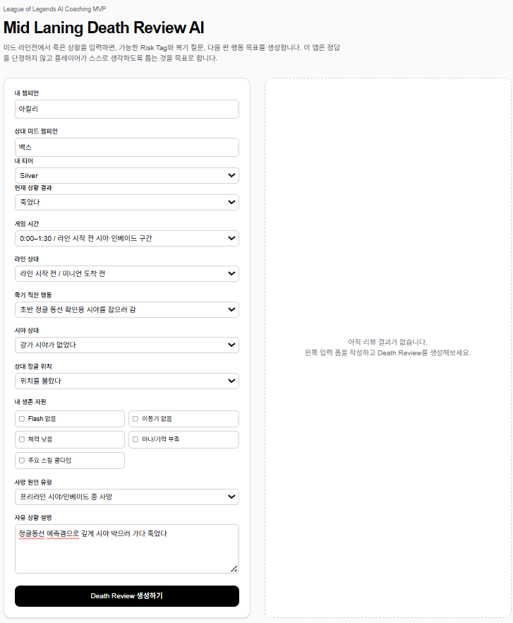
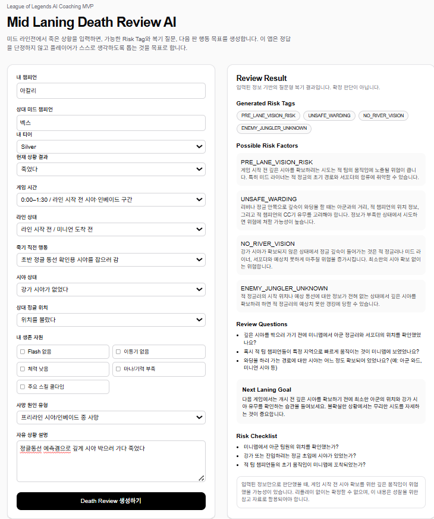
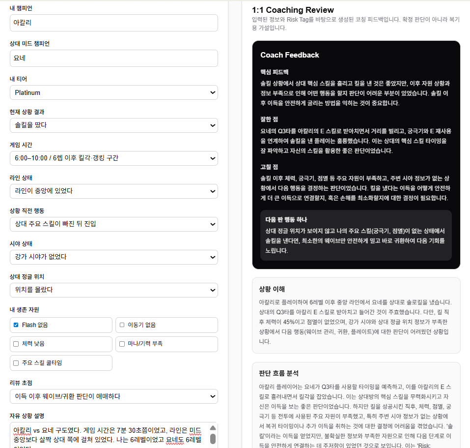

# Mid Laning Decision Review AI

AI coaching web app for reviewing League of Legends mid lane laning phase decisions.

This project helps players review mid lane situations such as deaths, bad trades, solo kills, lane priority, and CS/plate advantages by generating possible risk tags, 1:1 coach feedback, review checkpoints, and next-game action goals.

The goal of this app is not to give one fixed answer. Instead, it helps players think more clearly about their decision flow, understand possible risk factors, and choose one concrete action to try in the next game.

## Screenshots

### Input Form



### Review Result



### Level 2-B Coach Feedback



## Current Status

Level 2-B coaching feedback engine completed.

The app currently supports manual mid lane situation input, outcome-aware form options, risk tag generation, Gemini API review generation, Korean 1:1 coach feedback, tier-aware coaching depth, and a structured review result card.

Tested situation types include:

- Pre-lane vision death review
- Solo kill advantage conversion review
- Survived-but-lost bad trade review

## Main Features

- Mid lane situation input form
- Player tier selection
- Current outcome selection
- Outcome-aware action options
- Review focus selection
- Risk tag generation
- Gemini API review generation
- Coach Feedback summary card
- Korean 1:1 coaching feedback
- Tier-aware feedback depth
- Long-term pattern tags
- Review result card UI

## Example Risk Tags

- `PRE_LANE_VISION_RISK`
- `UNSAFE_WARDING`
- `NO_RIVER_VISION`
- `ENEMY_JUNGLER_UNKNOWN`
- `UNTRACKED_PUSH`
- `CS_GREED`
- `NO_FLASH_WINDOW`
- `NO_ESCAPE_TOOL`

## Design Philosophy

This app avoids saying, “This was definitely the reason you died.”

League of Legends situations are complex, and one death can come from many possible factors.  
Because of that, this app focuses on giving possible risk factors and reflection questions instead of forcing a single answer.

The goal is to help the player review their own decision-making.

## Tech Stack

- Next.js
- TypeScript
- Tailwind CSS
- Gemini API

## Project Structure

```text
app/
  api/review/route.ts      # Gemini API review route
  page.tsx                 # Main page

components/
  DeathReviewForm.tsx      # Input form
  ReviewResultCard.tsx     # Review result UI

lib/
  prompts.ts               # AI prompt design
  riskTagMapper.ts         # Rule-based risk tag generation

types/
  review.ts                # TypeScript types